# Skin Lesion Segmentation using U-Net

A deep learning based medical image segmentation project for **pixel-level skin lesion segmentation** from dermoscopic images using a custom **U-Net architecture** trained on the **ISIC 2016 Task 1 Lesion Segmentation dataset**.

The project implements an end-to-end segmentation workflow covering data exploration, preprocessing, U-Net development, custom loss functions, model training, quantitative evaluation, qualitative visualization, and failure-case analysis.

----
## Project Overview

Skin lesion segmentation is an important computer vision task in medical image analysis. Accurately separating a lesion from surrounding skin can provide a structured region of interest for downstream lesion analysis and computer-aided diagnostic systems.

This project develops a binary semantic segmentation model that takes a dermoscopic image as input and predicts a pixel-level mask corresponding to the lesion region.

### Workflow

```text
ISIC 2016 Dataset
        |
        v
Data Exploration
        |
        v
Image & Mask Preprocessing
        |
        +--> Resize to 256 x 256
        +--> Image normalization
        +--> Binary mask conversion
        |
        v
Train / Validation / Test Split
        |
        | 720 / 90 / 90
        v
Custom U-Net
        |
        +--> Encoder
        +--> Bottleneck
        +--> Decoder
        +--> Skip Connections
        |
        v
BCE + Dice Loss
        |
        v
Model Training
        |
        v
Best Model Checkpoint
        |
        v
Test Set Inference
        |
        +--> Dice
        +--> IoU
        +--> Precision
        +--> Recall
        +--> Pixel Accuracy
        |
        v
Qualitative Visualization
        |
        +--> Ground Truth
        +--> Predicted Mask
        +--> Prediction Overlay
        +--> Best / Worst Cases
```

---

## Problem Statement

Given a dermoscopic image, the objective is to identify the pixels belonging to the skin lesion and separate them from the surrounding background.

The model performs binary semantic segmentation:

```text
0 -> Background
1 -> Lesion
```

For an input image:

```text
256 x 256 x 3
```

the model produces:

```text
256 x 256 x 1
```

where each output pixel represents the predicted probability of belonging to the lesion class.

---

## Dataset

This project uses the **ISIC 2016 Task 1: Lesion Segmentation** dataset.

The dataset contains:

- 900 dermoscopic training images
- 900 corresponding binary segmentation masks

Each image has a corresponding ground-truth lesion mask.

### Dataset Characteristics

| Property | Value |
|---|---|
| Dataset | ISIC 2016 Task 1 |
| Total images | 900 |
| Total masks | 900 |
| Image type | Dermoscopic RGB images |
| Mask type | Binary segmentation masks |
| Original image dimensions | Approximately 767 x 1022 |
| Model input | 256 x 256 x 3 |
| Model output | 256 x 256 x 1 |
| Segmentation classes | Background / Lesion |

Dataset source:

**ISIC 2016 Challenge - Task 1: Lesion Segmentation**

https://challenge.isic-archive.com/landing/2016/37/

---

# Data Preprocessing

## Image and Mask Validation

The dataset was inspected to verify:

- Number of images and masks
- Filename correspondence
- Image dimensions
- Mask dimensions
- Mask pixel values

The segmentation masks contain:

```text
0   -> Background
255 -> Lesion
```

The masks were converted into binary floating-point arrays:

```python
mask = (mask_resized > 0).astype(np.float32)
```

---

## Image Resizing

The original dermoscopic images have varying dimensions.

All images were resized to:

```text
256 x 256 x 3
```

The following interpolation methods were used:

- `INTER_AREA` for RGB images
- `INTER_NEAREST` for segmentation masks

Nearest-neighbor interpolation was used for masks to preserve discrete class labels and avoid introducing intermediate values along segmentation boundaries.

---

## Image Normalization

RGB images were converted to `float32` and normalized to the range `[0, 1]`.

```python
image = image.astype(np.float32) / 255.0
```

---

## Dataset Split

The 900 images were divided into training, validation, and test sets using a fixed random state of `42`.

| Split | Number of Images | Percentage |
|---|---:|---:|
| Training | 720 | 80% |
| Validation | 90 | 10% |
| Test | 90 | 10% |
| **Total** | **900** | **100%** |

The test set was kept separate from training and validation and was used only for final evaluation.

---

# Model Architecture

## U-Net

The project uses a custom implementation of the **U-Net encoder-decoder architecture**.

U-Net is well suited for biomedical image segmentation because it combines hierarchical feature extraction with spatial reconstruction and skip connections.

### Architecture

```text
Input
256 x 256 x 3
      |
      v
Conv Block - 64
      |
   MaxPool
      |
      v
Conv Block - 128
      |
   MaxPool
      |
      v
Conv Block - 256
      |
   MaxPool
      |
      v
Conv Block - 512
      |
   MaxPool
      |
      v
Bottleneck - 1024
      |
      v
Transpose Conv - 512
      |
   Skip Connection
      |
Conv Block - 512
      |
      v
Transpose Conv - 256
      |
   Skip Connection
      |
Conv Block - 256
      |
      v
Transpose Conv - 128
      |
   Skip Connection
      |
Conv Block - 128
      |
      v
Transpose Conv - 64
      |
   Skip Connection
      |
Conv Block - 64
      |
      v
1 x 1 Conv
      |
      v
Sigmoid
      |
      v
256 x 256 x 1
```

### Convolution Blocks

Each convolution block contains two convolutional layers:

```text
Conv2D -> ReLU
Conv2D -> ReLU
```

The encoder progressively increases feature channels:

```text
64 -> 128 -> 256 -> 512 -> 1024
```

The decoder progressively reduces them:

```text
512 -> 256 -> 128 -> 64
```

### Skip Connections

Feature maps from the encoder are concatenated with the corresponding decoder feature maps.

These connections help the decoder recover spatial information lost during downsampling and improve localization of lesion boundaries.

---

## Model Configuration

| Parameter | Configuration |
|---|---|
| Architecture | Custom U-Net |
| Input size | 256 x 256 x 3 |
| Output size | 256 x 256 x 1 |
| Total parameters | ~31 million |
| Optimizer | Adam |
| Initial learning rate | 1e-4 |
| Batch size | 8 |
| Maximum epochs | 20 |
| Output activation | Sigmoid |
| Task | Binary semantic segmentation |

---

# Loss Function

The model was trained using a combination of **Binary Cross-Entropy (BCE)** and **Dice Loss**.

## Binary Cross-Entropy

Binary Cross-Entropy provides pixel-level classification supervision:

```text
BCE = -[y log(y_pred) + (1-y) log(1-y_pred)]
```

where:

- `y` is the ground-truth pixel
- `y_pred` is the predicted probability

---

## Dice Coefficient

The Dice coefficient measures overlap between the predicted and ground-truth lesion regions:

```text
             2 x |Prediction ∩ Ground Truth|
Dice = ---------------------------------------------
          |Prediction| + |Ground Truth|
```

A value closer to `1` indicates greater overlap.

---

## Dice Loss

```text
Dice Loss = 1 - Dice
```

---

## Combined Loss

The final training objective was:

```text
Combined Loss = Binary Cross-Entropy + Dice Loss
```

Using both losses provides pixel-level classification supervision while directly encouraging region-level overlap.

---

# Training

The model was compiled using the Adam optimizer with an initial learning rate of `1e-4`.

### Training Configuration

```text
Optimizer       : Adam
Learning Rate   : 1e-4
Batch Size      : 8
Maximum Epochs  : 20
Loss            : BCE + Dice Loss
Output          : Sigmoid
```

## Training Callbacks

### EarlyStopping

Training monitored validation Dice:

```python
monitor="val_dice_coefficient"
mode="max"
patience=5
restore_best_weights=True
```

### ReduceLROnPlateau

The learning rate was reduced when validation loss stopped improving:

```python
factor=0.5
patience=2
min_lr=1e-6
```

### ModelCheckpoint

The model with the best validation Dice was saved using:

```python
save_best_only=True
```

The saved checkpoint was:

```text
unet_skin_lesion_best.keras
```

---

# Training Results

The model showed consistent improvement during the completed training epochs.

| Epoch | Training Dice | Validation Dice | Validation Loss |
|---:|---:|---:|---:|
| 1 | 0.4111 | 0.4352 | 0.9948 |
| 2 | 0.5862 | 0.6379 | 0.7554 |
| 3 | 0.7010 | 0.7442 | 0.5449 |
| 4 | 0.7423 | **0.7641** | **0.4892** |

The best completed validation result was:

**Validation Dice = 0.7641**

The U-Net contains approximately 31 million parameters, making training computationally intensive. Training was performed in Google Colab using GPU acceleration.

The runtime was interrupted during the fifth epoch because of Google Colab GPU usage limitations. Since the best checkpoint had already been saved, the saved best model was retained and used for final test-set evaluation.

No performance claims are made for the incomplete fifth epoch.

---

# Test Set Evaluation

The saved best U-Net checkpoint was evaluated on a **held-out test set of 90 images** that were not used during model training or validation.

For each test image, the model generated a pixel-wise probability map. The probability map was converted into a binary segmentation mask using a threshold of `0.5`.

### Quantitative Results

| Metric               |      Score | Percentage |
| -------------------- | ---------: | ---------: |
| **Dice Coefficient** | **0.7875** | **78.75%** |
| **IoU / Jaccard**    | **0.6872** | **68.72%** |
| **Precision**        | **0.8244** | **82.44%** |
| **Recall**           | **0.7583** | **75.83%** |
| **Pixel Accuracy**   | **0.8909** | **89.09%** |

### Metric Interpretation

* **Dice Coefficient — 0.7875:** Measures the overlap between the predicted lesion region and the ground-truth lesion region.
* **IoU — 0.6872:** Measures the intersection between predicted and ground-truth regions relative to their union.
* **Precision — 0.8244:** Measures how many pixels predicted as lesion actually belong to the lesion region.
* **Recall — 0.7583:** Measures how many of the actual lesion pixels were successfully detected.
* **Pixel Accuracy — 0.8909:** Measures the percentage of correctly classified pixels across the image.

Dice and IoU are treated as the primary segmentation metrics because pixel accuracy can be influenced strongly by the large background region.

### Validation vs Test Performance

The best completed validation Dice score was **0.7641**. The final held-out test evaluation achieved a Dice score of **0.7875**.

The validation score was used during model development and checkpoint selection, while the test set was reserved for final evaluation.

---

# Visual Results

The model predictions were evaluated qualitatively by comparing the original dermoscopic image, ground-truth lesion mask, predicted mask, and prediction overlay.

### Sample Predictions

Representative test-set predictions are shown below.

| Sample 1                                              | Sample 2                                              |
| ----------------------------------------------------- | ----------------------------------------------------- |
| 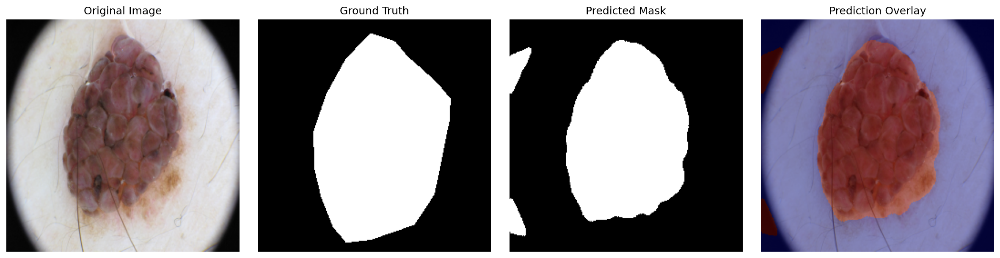 | 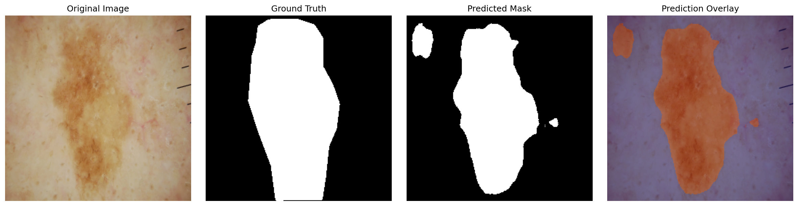 |

| Sample 3                                              | Sample 4                                              |
| ----------------------------------------------------- | ----------------------------------------------------- |
| 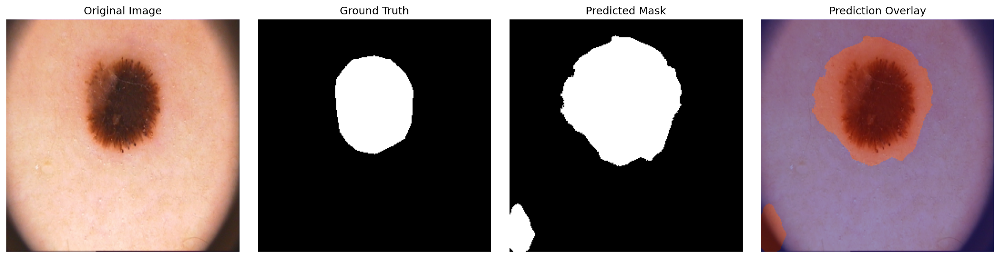 | 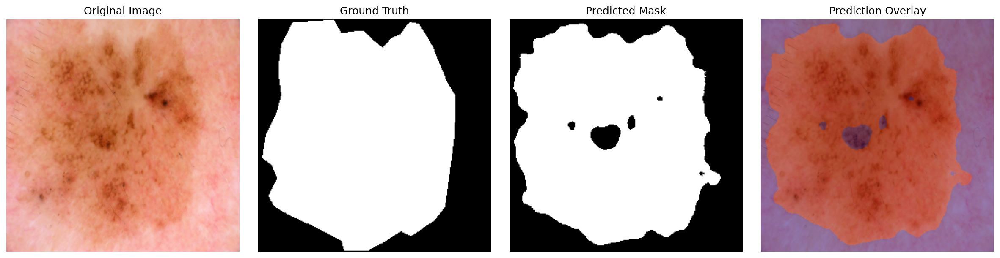 |

| Sample 5                                              |
| ----------------------------------------------------- |
| 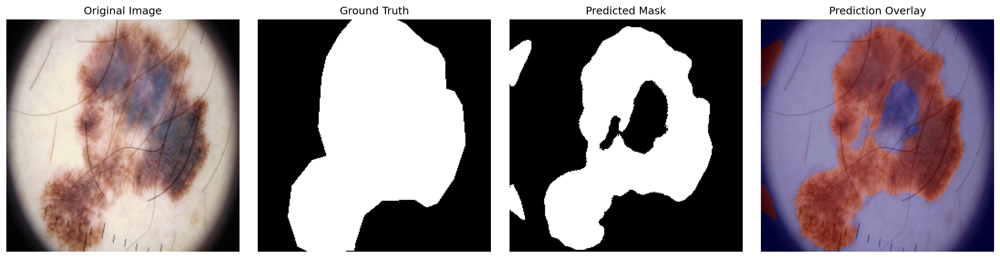 |

Each visualization contains:

**Original Image → Ground Truth → Predicted Mask → Prediction Overlay**

### Best-Performing Predictions

The highest-performing test cases demonstrate strong spatial agreement between the predicted segmentation and the ground-truth lesion boundaries.

| Best Case 1                                                | Best Case 2                                                |
| ---------------------------------------------------------- | ---------------------------------------------------------- |
| 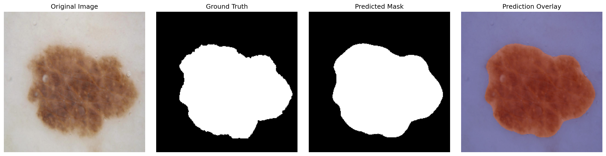 | 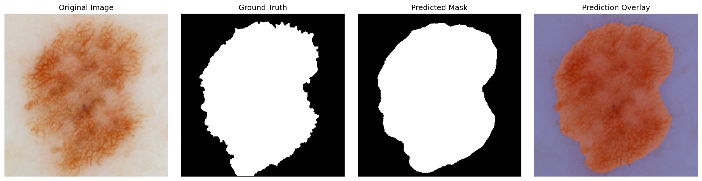 |

| Best Case 3                                                |
| ---------------------------------------------------------- |
| 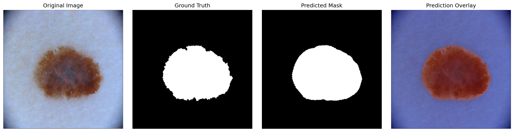 |

### Challenging / Worst-Performing Predictions

The lowest-performing cases were examined to understand where the model struggled. These examples help identify failure modes such as small lesions, weak contrast, irregular boundaries, artifacts, false-positive regions, and missed lesion pixels.

| Challenging Case 1                                            | Challenging Case 2                                            |
| ------------------------------------------------------------- | ------------------------------------------------------------- |
| 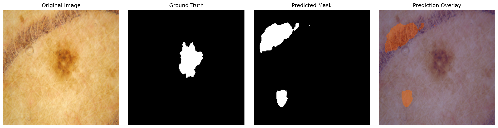 | 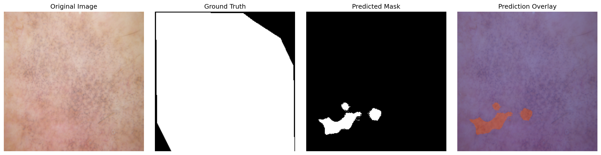 |

| Challenging Case 3                                            |
| ------------------------------------------------------------- |
| 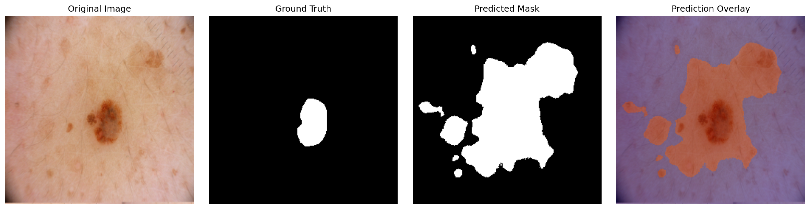 |

These qualitative examples complement the numerical evaluation by showing how segmentation quality varies across different image characteristics.


---
# Limitations

### 1. Computational Cost

The custom U-Net contains approximately 31 million parameters, making training computationally expensive.

### 2. Limited Training Data

Only 720 images were used for model training, which limits the diversity of training examples.

### 3. Limited Data Augmentation

The current preprocessing pipeline primarily performs resizing, normalization, and mask binarization. More extensive augmentation could improve generalization.

### 4. Fixed Input Resolution

Resizing images to `256 x 256` can remove fine-grained spatial information and small lesion boundary details.

### 5. Basic U-Net Architecture

The implementation does not use a pretrained encoder or more advanced segmentation architecture.

### 6. Binary Segmentation

The model predicts lesion versus background and does not perform disease classification.

### 7. Dataset-Specific Evaluation

The final evaluation was performed on a held-out subset of the same dataset rather than an independent external clinical dataset.

---

# Future Improvements

Potential improvements include:

- Apply rotation, flipping, scaling, cropping, and brightness/contrast augmentation
- Use pretrained encoders such as ResNet, EfficientNet, or MobileNet
- Experiment with U-Net++
- Implement Attention U-Net
- Explore DeepLabV3+
- Explore Feature Pyramid Networks
- Experiment with Focal Loss
- Experiment with Tversky or Focal Tversky Loss
- Increase input resolution
- Optimize the segmentation threshold
- Perform k-fold cross-validation
- Evaluate on independent external datasets
- Apply morphological post-processing
- Use connected-component analysis to remove small false-positive regions

---

# Project Structure

```text
Skin-Lesion-Segmentation-UNet/
│
├── data/                         # Dataset files (not uploaded)
│   ├── images/
│   ├── masks/
│   ├── X_train.npy
│   ├── Y_train.npy
│   ├── X_val.npy
│   ├── Y_val.npy
│   ├── X_test.npy
│   └── Y_test.npy
│
├── notebooks/
│   ├── 01_data_exploration_preprocessing.ipynb
│   ├── 02_unet_training_colab.ipynb
│   └── 03_evaluation_visualization.ipynb
│
├── models/
│   └── unet_skin_lesion_best.keras
│
├── results/
│   ├── evaluation_metrics.json
│   ├── evaluation_metrics.txt
│   │
│   ├── best_predictions/
│   │   ├── best_01.png
│   │   ├── best_02.png
│   │   └── best_03.png
│   │
│   ├── worst_predictions/
│   │   ├── worst_01.png
│   │   ├── worst_02.png
│   │   └── worst_03.png
│   │
│   └── sample_predictions/
│       ├── sample_01.png
│       ├── sample_02.png
│       ├── sample_03.png
│       ├── sample_04.png
│       └── sample_05.png
│
├── src/
│   ├── 02_unet_training_colab.py
│   └── 03_evaluation_visualization.py
│
├── app.py
├── README.md
├── requirements.txt
├── .gitignore
└── .python-version
```

The `results/` directory contains the final test-set metrics and qualitative prediction visualizations used for model evaluation.


Large dataset files, preprocessed NumPy arrays, and model checkpoints may be excluded from the GitHub repository because of their size.

---

# Notebook Organization

## `01_data_exploration_preprocessing.ipynb`

Contains:

- Dataset inspection
- Image and mask verification
- Image dimension analysis
- Mask value analysis
- Lesion coverage analysis
- Image and mask visualization
- Image resizing
- Mask preprocessing
- Image normalization
- Train/validation/test splitting
- Saving preprocessed NumPy arrays

---

## `02_unet_training.ipynb`

Contains:

- U-Net architecture implementation
- Encoder and decoder construction
- Skip connections
- Dice coefficient
- Dice loss
- Combined BCE + Dice loss
- Model compilation
- Training callbacks
- Model training
- Training metrics
- Best-model checkpointing

---

## `03_evaluation_visualization.ipynb`

Contains:

- Loading the trained model
- Test-set inference
- Probability-to-mask conversion
- Dice calculation
- IoU calculation
- Precision
- Recall
- Pixel accuracy
- Prediction visualization
- Best-case analysis
- Worst-case analysis
- Error analysis

---

# Technologies Used

- **Python**
- **TensorFlow**
- **Keras**
- **NumPy**
- **OpenCV**
- **Matplotlib**
- **Scikit-learn**
- **Pillow**
- **Jupyter Notebook**
- **Google Colab**
- **Google Drive**

---

# Reproducibility

The preprocessing pipeline uses:

```text
Random State = 42
```

### Input Processing

```text
Resolution = 256 x 256
Channels   = 3
Range      = [0, 1]
```

### Mask Processing

```text
Background = 0
Lesion     = 1
```

### Training Configuration

```text
Architecture    = U-Net
Optimizer       = Adam
Learning Rate   = 1e-4
Batch Size      = 8
Loss            = BCE + Dice Loss
Output          = Sigmoid
Threshold       = 0.5
```

---

# Installation

Create a Python virtual environment:

```bash
python -m venv .venv
```

Activate the environment on Windows:

```powershell
.venv\Scripts\activate
```


## Run the App Locally

To run the Skin Lesion Segmentation application locally:

### 1. Clone the repository

```bash
git clone https://github.com/salonipandagale/Skin-Lesion-Segmentation-UNet.git
cd Skin-Lesion-Segmentation-UNet
```

### 2. Install the required dependencies:

```bash
pip install -r requirements.txt
```
### 3. Run streamlit
```bash
streamlit run app.py

```
# Running the Project

Execute the notebooks in the following order:

```text
01_data_exploration_preprocessing.ipynb
                |
                v
02_unet_training.ipynb
                |
                v
03_evaluation_visualization.ipynb
```

For training, a GPU-enabled environment such as Google Colab is recommended because of the computational requirements of the U-Net architecture.

---

# Results Summary

The final saved checkpoint was evaluated on 90 unseen test images.

```text
Dice       : 0.7875
IoU        : 0.6872
Precision  : 0.8244
Recall     : 0.7583
Accuracy   : 0.8909
```

The model demonstrates the ability to segment the main lesion region in a substantial portion of dermoscopic images while also revealing challenging cases involving small lesions, low contrast, irregular boundaries, and image artifacts.

---

# Key Learnings

This project provided practical experience with:

- Medical image preprocessing
- Binary semantic segmentation
- U-Net architecture design
- Encoder-decoder networks
- Skip connections
- Custom loss functions
- Dice-based optimization
- Pixel-level evaluation
- Model checkpointing
- GPU-based deep learning training
- Qualitative segmentation analysis
- Failure-case investigation

---

# Conclusion

This project implements a complete deep learning pipeline for skin lesion segmentation using a custom U-Net architecture.

The model was trained on the ISIC 2016 lesion segmentation dataset and evaluated on a held-out test set of 90 images.

The final evaluation achieved:

- **0.7875 Dice coefficient**
- **0.6872 IoU**
- **0.8244 precision**
- **0.7583 recall**
- **0.8909 pixel accuracy**

In addition to quantitative evaluation, prediction visualizations and failure-case analysis were performed to understand the model's strengths and limitations.

The project demonstrates the application of deep learning and computer vision techniques to a real-world medical image segmentation problem and provides a foundation for further experimentation with pretrained encoders, advanced segmentation architectures, data augmentation, and improved loss functions.

---

## Disclaimer

This project is intended for **educational and research purposes only**.

The model is **not a clinical diagnostic system** and should not be used for medical diagnosis, treatment decisions, or clinical decision-making.
